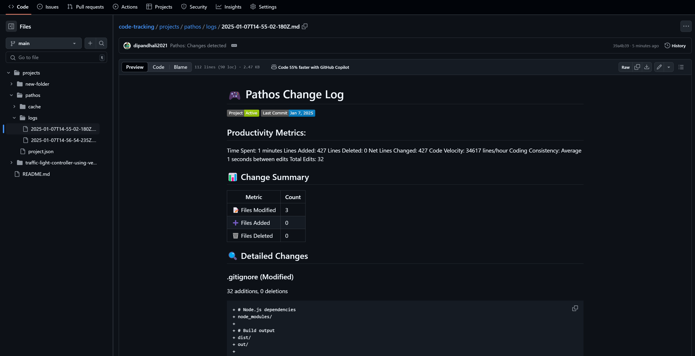

# Pathos 🚀

> Automated developer activity tracking and insights for VS Code

Pathos is a powerful VS Code extension that automatically tracks your coding activities and provides meaningful insights into your development journey, without requiring manual commits. The name "Pathos" evokes a sense of purpose and tells the story behind development.

## 🌟 Features

### Core Functionality
- **Secure GitHub Authentication**: One-time secure authentication process
- **Automatic Repository Creation**: Creates a dedicated tracking repository with public/private options
- **Smart Project Tracking**: Hidden folder creation with automatic .gitignore configuration
- **Secure Data Management**: High-level security implementation for tracked code protection
- **Detailed Work Reports**: Comprehensive documentation of your coding activities
- **AI-Powered Insights**: Intelligent analysis of your development patterns

### User Friendly Folder Structure
- Proper way of storing the project specific commits
- caching of project files in each folder with proper encryption for future tracking
- proper readme generation

### Real-Time Monitoring
- **File Creation Tracking**
- **Modification Detection**
- **Deletion Logging**
- **Content Change Analysis**

### Visual Integration
- **Intuitive Status Bar Icon**: Quick access to extension status and commands
- **Project-Specific README**: Automatic creation and maintenance
- **Visual Progress Reports**: Charts and graphs showing your contribution patterns

## Code Tracking Preview

## 🚀 Why Pathos?

- **Proof of Work**: Maintain detailed, verifiable records of your daily work
- **Commit-Free Tracking**: No need to commit work-in-progress code
- **Branch Contribution Tracking**: Track work across all branches, even with squashed commits
- **Automated Documentation**: Let Pathos handle the documentation while you focus on coding

## 📋 Requirements

- GitHub account
- Git installed and configured
- VS Code (latest stable version recommended)

## 🔧 Installation

1. Open VS Code
2. Access Extensions Marketplace (`Ctrl+Shift+X` or `Cmd+Shift+X`) or click on Extensions icon at left vertical bar
3. Search for "Pathos"
4. Click Install

## 🏃‍♂️ Getting Started

1. **Connect GitHub**
   - Click the Pathos icon in the status bar
   - Follow the GitHub authentication process

2. **Configure Tracking**
   - Set your preferred tracking interval
   - Choose repository visibility (public/private)
   - Select folders to track (if needed)(coming soon)

3. **Start Coding**
   - Pathos will automatically begin tracking your work
   - View progress through the extension UI

## 🔄 Workflow

1. **Initial Setup**
   - Automatic repository creation
   - Hidden tracking folder configuration
   - .gitignore setup

2. **Active Tracking**
   - File monitoring
   - Change detection
   - Report generation

3. **Insight Generation**
   - AI-powered analysis
   - Visual representations
   - Progress tracking

## 🛡️ Security

- Secure GitHub authentication
- Encrypted data storage
- Protected tracking information
- Configurable privacy settings

## 🔜 Coming Soon

- Folder selection customization
- AI credits system with free analyses
- Enhanced UI features
- Subscription options for advanced features

## 🤝 Contributing

Contributions are welcome! Please follow these steps:

1. Fork the repository
2. Create your feature branch (`git checkout -b feature/newFeature`)
3. Commit your changes (`git commit -m 'Add some newFeature'`)
4. Push to the branch (`git push origin feature/newFeature`)
5. Open a Pull Request

## 📝 License

This project is licensed under the MIT License - see the [LICENSE](LICENSE) file for details.

## 🌟 Support

Having issues or ideas for improvement? We'd love to hear from you:
- Open an issue
- Submit a feature request
- Join our community discussions

---

Made with ❤️ for developers
